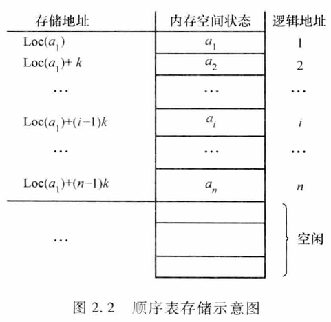

# 2.1 线性表的概念及其抽象数据类型定义

## 2.1.1 线性表的逻辑结构

**线性表(Linear List) 描述**：线性表是 n 个类型相同数据元素的有限序列，对 n>O，除第一元素无直接前驱、最后一个元素无直接后继外，其余的每个数据元素只有一个直接前驱和一个直接后继

在一般的线性表中，一个**数据元素(Data Elements)** 可由若干数据项组成，如表 1. 1 所示的学籍表中，每个学生相关信息由学号、姓名、性别、籍，贯等数据项组成，表 1. 1 中的一行称为一个**记录（或称数据元素）**，含有大量类型相同记录的线性表称为**文件（或称数据对象）**

综上所述，线性表是由 n(n~O)个类型相同数据元素组成的有限序列，记作 $(a_{1},a_{2},\dots,a_{i-1}, a_{i},,a_{i+1} \dots,a_{n})$
线性表的特点：
1. 同一性：线性表由同类数据元素组成，每一个 $a_{i}$ 必须属于同一数据类型
2. 有穷性： 线性表由有限个数据元素组成，表长度就是表中数据元素的个数
3. 有序性： 线性表中相邻数据元素之间存在着序偶关系
线性表既是一种**最简单的数据结构**（因为数据元素之间是由前驱、后继直观、有序的关系确定的），又是一种**最常见的数据结构**（因为矩阵、数组、字符串、堆栈、队列等都符合线性条件）

## 2.1.2 线性表的抽象数据类型定义
下面给出线性表的抽象数据类型定义。

ADT LinearList{
数据元素:  
 $D = \{aᵢ | aᵢ ∈ D₀, i = 1, 2, …, n, n ≥ 0\}, D₀$ 为某一数据类型  

结构关系:  
 $R = \{< aᵢ, aᵢ₊₁>; | aᵢ, aᵢ₊₁ ∈ D₀, i = 1, 2, …, n-1\}$  

基本操作：  

1. InitList (L)  
 操作前提：L 为未初始化线性表。  
 操作结果：将 L 初始化为空表。  

2. ListLength (L)  
 操作前提：线性表 L 已存在。  
 操作结果：如果 L 为空表则返回 0，否则返回表中的元素个数。  

3. GetData (L, i)  
 操作前提：表 L 存在，且 1 ≤ i ≤ ListLength (L)。  
 操作结果：返回线性表 L 中第 i 个数据元素的值。  

4. InsList (L, i, e)  
 操作前提：表 L 已存在，e 为合法元素值且 1 ≤ i ≤ ListLength (L)+1。  
 操作结果：在 L 中第 i 个位置之前插入新的数据元素 e，L 的长度加 1。  

5. DelList (L, i, e)  
 操作前提：表 L 已存在且非空，1 ≤ i ≤ ListLength (L)。  
 操作结果：删除 L 的第 i 个数据元素，并用 e 返回其值，L 的长度减 1。  

6. Locate (L, e)  
 操作前提：表 L 已存在，e 为合法数据元素值。  
 操作结果：如果 L 中存在数据元素 e，则将当前指针指向数据元素 e 所在位置并返回 TRUE，否则返回 FALSE。  

7. DestroyList (L)  
 操作前提：线性表 L 已存在。  
 操作结果：将 L 销毁。  

8. ClearList (L)  
 操作前提：线性表 L 已存在。  
 操作结果：将 L 置为空表。  

9. EmptyList (L)  
 操作前提：线性表 L 已存在。  
 操作结果：如果 L 为空表则返回 TRUE，否则返回 FALSE。  

}ADT LinearList;
# 2.2 线性表的顺序存储
## 2.2.1 线性表的顺序存储结构
采用顺序存储结构存储的线性表通常简称为**顺序表**。 可将顺序表归纳为：**关系线性化**，**结点顺序存**
在顺序表中，每个结点 $a_{i}$ 的存储地址是该结点在表中的逻辑位置 i 的**线性函数**，只要知道**线性表中第一个元素的存储地址**（基地址）和**表中每个元素所占存储单元的多少**，就可以计算出线性表中任意一个数据元素的存储地址，从而实现对顺序表中数据元素的**随机存取**

### 1. 地址的计算
假设线性表中有 $n$ 个元素，每个元素占 $k$ 个单元，第一个元素的地址为 $\mathrm{Loc}(a_1)$，则可通过如下公式计算出第 $i$ 个元素的地址 $\mathrm{Loc}(a_i)$：

$$
\mathrm{Loc}(a_i) = \mathrm{Loc}(a_1) + (i-1) \times k
$$

其中，$\mathrm{Loc}(a_1)$ 称为基地址。
### 2. 线性表顺序存储的表示
线性表的顺序存储结构可借助于高级程序设计语言中的一维数组来表示，一维数组的下标与元素在线性表中的序号相对应
用 C 语言定义线性表的顺序存储结构如下：
```
#define MAXSIZE 100         ／ ＊此处的宏定义常昼表示线性表的最大长度＊／
typedef struct {
    ElemType elem[MAXSIZE]; / ＊线性表占用的数组空间＊／
    int last;             ／ ＊记录线性表中最后一个元素在数组 elem[］ 中的位置（下标值），空表置为－1＊／
} SeqList;
```
说明：
1. 结点类型定义中ElemType 数据类型是为了描述的统一而自定的，在实际应用中，用户可以根据自己实际需要来具体定义顺序表中元素的数据类型，如int、char、float 或是一种 struct 结构类型
2. 从数组中起始下标为 0 处开始存放线性表中第一个元素。因此需注意区分元素的序号和该元素在数组中的下标位置之间的对应关系，即数据元素 $a_{1}$ 的序号为 1，而其对应存放在 elem 数组的下标为 0；$a_{i}$ 在线性表中的序号值为 i，而在顺序表对应的数组 elem 中的下标为 i-1
   
变量 L 的定义与使用方法有以下两种：

① 通过变量定义语句  
	SeqList L;  
	将 L 定义为 SeqList 类型的变量，利用 L.elem[i-1] 来访问顺序表中序号为 i 的元素 aᵢ；通过 L.last 可得到顺序表中最后一个元素的下标，而 L.last+1 就是顺序表的长度。  
	
② 通过指针变量定义语句  
	 SeqList L₁, \*L; L = &L₁;  
	将 L 定义为指向 SeqList 类型的指针变量，使用时，可通过 L->elem[i-1] 来访问顺序表中序号为 i 的元素 $a_{i}$，使用 L->last+1 则得到顺序表的长度。
## 2.2.2 线性表顺序存储结构上的基本运算
### 1. 查找操作
1. 按序号查找 GetData (L, i)：查找顺序表 L 中第 i 个数据元素。  
   根据顺序表 L 的存储特性，表中元素在 L 的 elem 数组中顺序存放，故 GetData (L, i) 的核心语句为 L.elem[i-1]。  
2.  按内容查找 Locate (L, e)：要求查找顺序表 L 中与给定值 e 相等的数据元素。  
   在顺序表 L 中找到与 e 相等的元素，则返回该元素在表中的序号；若找不到，则返回一个“空序号”标识，如 -1。
   
算法思想：查找运算可采用顺序查找，即从第一个元素开始，依次将表中元素与 e 相比较，若相等，则查找成功，返回该元素在表中的序号；若 e 与表中的所有元素都不相等，则查找失败返回－1
算法 2.1：顺序表的按内容查找运算
```
int Locate(SeqList L, ElemType e) {
    int i = 0;
    while (i <= L.last && L.elem[i] != e) {
        i++;
    }
    if (i <= L.last) {
        return i + 1; // 返回元素的序号
    } else {
        return -1; // 查找失败
    }
}
```
算法2. 1 的时间复杂度为 O(n)
### 2. 插入操作
线性表的插入运算是指在表的第$i（1 ≤ i ≤ n+1）$个位置前插入一个新元素 e，使长度为 n 的线性表  
$(e₁, …, e_{i-1}, e_i, …, e_n)$
变成长度为 n+1 的线性表  
$(e₁, …, e_{i-1}, e, e_i, …, e_n)$  
（其中 n 为 L 的表长度）。
算法思想：用顺序表作为线性表的存储结构时，由于结点的物理顺序必须和结点的逻辑顺序保持一致，因此必须将原表中位置 n, n-1, …, i 上的结点，依次后移到位置 n+1, n, …, i+1 上，空出第 i 个位置，然后在该位置上插入新结点 e。  当 i = n+1 时，是指在线性表的末尾插入结点，所以无须移动结点，直接将 e 插入表的末尾即可。
算法2.2 ：顺序表的插入运算
```
#define OK 1
#define ERROR 0
int initList(SeqList *L,int i,ElemType e) {
    int j;
    
    if (i < 1 || i > L->last + 2) { // 插入位置不合法
        print("位置不合法\n");
        return ERROR;
    }

    if (L->last == MAXSIZE - 1) { // 表满
        print("表满，无法插入\n");
        return ERROR;
    }

    for (j = L->last; j >= i - 1; j--) { // 元素后移
        L->elem[j + 1] = L->elem[j];
    }
    L->elem[i - 1] = e; // 插入新元素
    L->last++; // 表长加 1
    return OK;
}
```
算法分析：
当在表尾（i = L->last + 2）插入元素时，因为循环的终值大于初值，此时不需要移动元素，可直接在表尾插入 e。  
当在表头（i = 1）插入时，移动元素的语句 L->elem[k+1] = L->elem[k] 需执行 n 次，即将表中已存在的 n 个元素依次后移一个位置才能将 e 插入。  
因此，语句 L->elem[k+1] = L->elem[k] 的执行频度与插入位置 i 有关。  

设 $E_{\text{ins}}$ 为在长度为 n 的表中插入一元素所需移动元素的平均次数，假设 $P_i$ 为在第 i 个元素之前插入元素的概率，并假设在任何位置上插入的概率相等，即 $P_i = \dfrac{1}{n+1},\ i=1,2,\dots,n+1$，则有  

$$
E_{\text{ins}} = \sum_{i=1}^{n+1} P_i \cdot (n - i + 1)
            = \frac{1}{n+1} \sum_{i=1}^{n+1} (n - i + 1)
            = \frac{1}{n+1} \cdot \frac{n(n+1)}{2}
            = \frac{n}{2}
$$
### 3. 删除操作
线性表的删除运算是指将表的第 $i（1 ≤ i ≤ n）$个元素删去，使长度为 n 的线性表  
$(e₁, …, e_{i-1}, e_i, e_{i+1}, …, e_n)$  
变成长度为 n-1 的线性表  
$(e₁, …, e_{i-1}, e_{i+1}, …, e_n)$  

算法思想：用顺序表作为线性表的存储结构时，由于结点的物理顺序必须和结点的逻辑顺序保持一致，因此当需要删除第 i 个元素时，必须将原表中位置在 i+1, i+2, …, n-1, n 上的结点，依次前移到位置 i, i+1, …, n-1（其中 n 为 L 的表长度）。
算法2.3 ：顺序表的删除运算
```
int DelList(SeqList *L, int i, ElemType *e) {
    int j;

    if (i < 1 || i > L->last + 1) { // 删除位置不合法
        print("位置不合法\n");
        return ERROR;
    }

    *e = L->elem[i - 1]; // 保存被删除元素的值，存放到 e所指向的变批中

    for (j = i; j <= L->last; j++) { // 元素前移
        L->elem[j - 1] = L->elem[j];
    }
    L->last--; // 表长减 1
    return OK;
}
```
### 4. 合并操作
算法2.4：线性表的合并运算
```
void mergeList(SeqList La, SeqList Lb, SeqList *Lc) {
    int i, j，k,l;
    i = 0; j = 0; k = 0;
    while (i <= La.last && j <= Lb.last) {
        if (La.elem[i] <= Lb.elem[j]) {
            Lc->elem[k++] = La.elem[i++];
        } else {
            Lc->elem[k++] = Lb.elem[j++];
        }
    }
    while (i <= La.last) {  //当表La有剩余元素时
        Lc->elem[k] = La.elem[i];   
        i++; k++;
    }
    while (j <= Lb.last) {
        Lc->elem[k] = Lb.elem[j];   
        j++; k++;
    }
    Lc->last = La->last + Lb->last + 1;
}
```
# 2.3 线性表的链式存储
## 2.3.1 单链表
## 2.3.2 单链表上的基本运算
## 2.3.3 循环链表
## 2.3.4 双向链表
# 2.4 线性表应用一一一元多项式的表示及相加
# 2.5 顺序表与链表的综合比较
## 2.5.1 顺序表和链表的比较
## 2.5.2 线性表链式存储方式的比较
