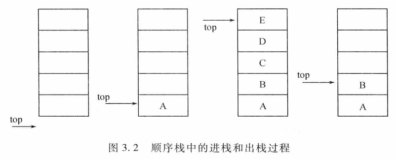
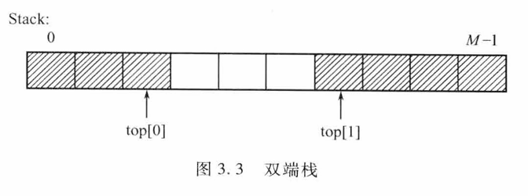

# 3.1 栈
## 3.1.1 栈的定义
### 1. 概念
- 限定性线性表：插入、删除**只能在同一端**进行。
- 允许操作的一端叫**栈顶（Top）**，另一端叫**栈底（Bottom）**。
- 无元素时为空栈。
- 修改原则：**后进先出（LIFO）**。
  
### 2. 术语
- 入栈/进栈：插入操作。
- 出栈/退栈：删除操作。

### 3. 实例
- 手枪弹夹：先压入的子弹最后打出。
- 铁路调度站：车辆先进后出。

### 4. 抽象数据类型 ADT Stack
| 操作 | 描述 |
|---|---|
| `InitStack(S)` | 初始化空栈 |
| `ClearStack(S)` | 置空栈 |
| `IsEmpty(S)` | 判空，空返回 TRUE |
| `IsFull(S)` | 判满，满返回 TRUE |
| `Push(S,x)` | 栈顶插入 x；满则失败返回 FALSE |
| `Pop(S,x)` | 弹出栈顶元素并由 x 带回；空则失败返回 FALSE |
| `GetTop(S,x)` | 读取栈顶元素到 x，**不弹出**；空则失败返回 FALSE |
## 3.1.2 栈的表示和实现
> 栈作为一种特殊的线性表，在计算机中主要有两种基本的存储结构：顺序存储结构和链式存储结构。我们简称顺序存储的栈为顺序栈，链式存储的栈为链栈。

### 1. 顺序栈
顺序栈是用顺序存储结构实现的栈，即利用一组地址连续的存储单元依次存放自栈底到栈顶的数据元素，同时由于栈操作的特殊性，还必须附设一个位置指针 top （栈顶指针）来动态地指示栈顶元素在顺序栈中的位置。通常以 top=-1 表示空栈。定义如下
```c
#define Stack_Size 50	//设栈中元素个数为 50
typedef struct{
	StackElementType elem[Stack_Size];	//用来存放栈中元素的一维数组
	int top;	//用来存放栈顶元素的下标，top 为－1 表示空栈
}SeqStack;
```

1. 初始化
   ```c
   void InitStack(SeqStack *S){
		S->top=-1;	//构建空栈S
   }
   ```
2. 进栈
```c
int Push(SeqStack *S, StackElementType x){
   if(S->top==Stack_Size-1)	//栈满
      return FALSE;
   S->elem[++(S->top)]=x;	//栈顶指针加 1 后，将元素 x 入栈
   return TRUE;
}
```
3. 出栈
```c
int Pop(SeqStack *S, StackElementType *x){
   if(S->top==-1)	//栈空
      return FALSE;
   *x=S->elem[(S->top)--];	//将栈顶元素赋值给 x 后，栈顶指针减 1
   return TRUE;
}
```
4. 读栈顶元素
```c
int GetTop(SeqStack S, StackElementType *x){
   if(S.top==-1)	//栈空
      return FALSE;
   *x=S.elem[S.top];	//将栈顶元素赋值给 x
   return TRUE;
}
```
5. 多栈共享技术
### 双栈共享
```c
#define Stack_Size 50	//设栈中元素个数为 50
typedef struct{
   StackElementType elem[Stack_Size];	//用来存放栈中元素的一维数组
   int top1;	//用来存放栈 1 栈顶元素的下标，top1 为－1 表示栈 1 为空
   int top2;	//用来存放栈 2 栈顶元素的下标，top2 为 Stack_Size 表示栈 2 为空
}DSeqStack;
```

- 栈 1 从数组的低地址端开始向高地址端增长，栈 2 从数组的高地址端开始向低地址端增长。
- 当 top1+1==top2 时，表示栈满。
### 多栈共享
- 可根据需要在数组中划分多个栈空间。
### 2. 链栈
## 3.1.3 栈的应用举例
## 3.1.4 栈与递归的实现
# 3.2 队列
## 3.2.1 队列的定义
## 3.2.2 队列的表示和实现
## 3.2.3 队列的应用举例
