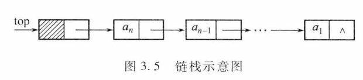
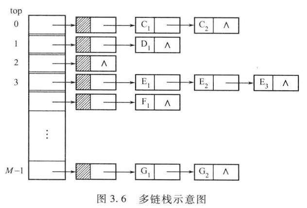
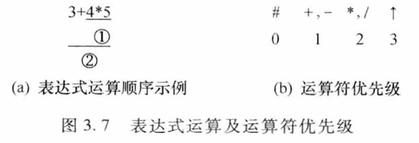
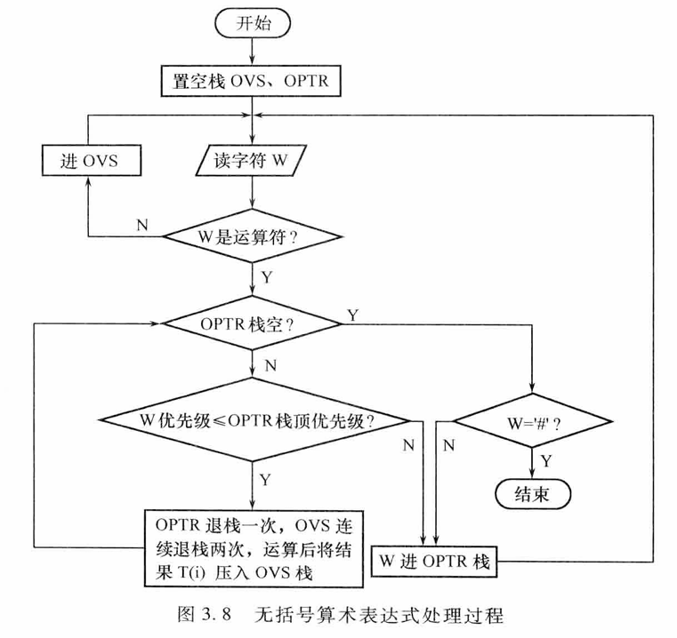
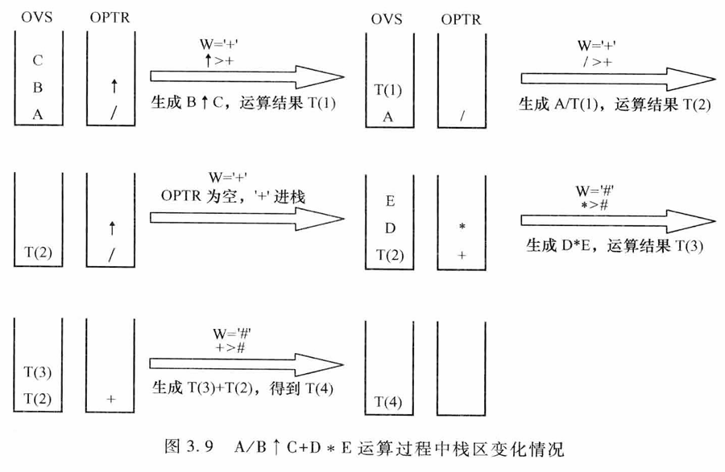
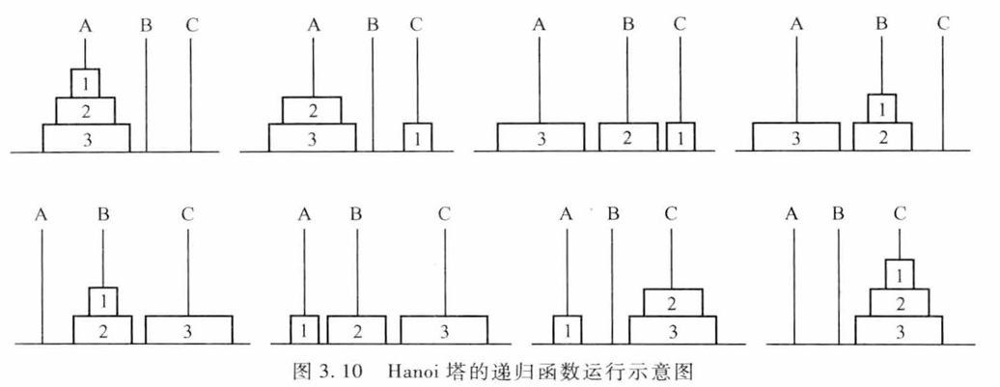
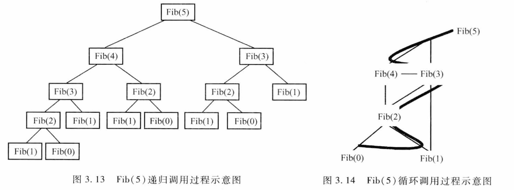
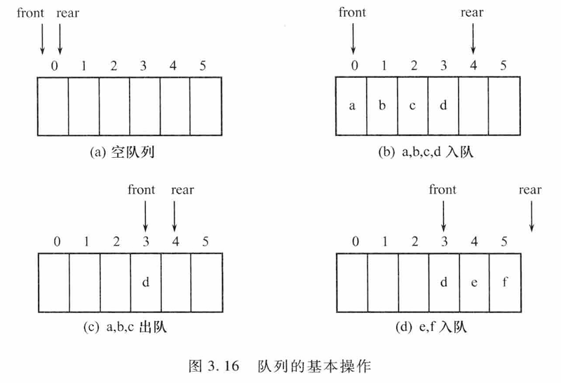
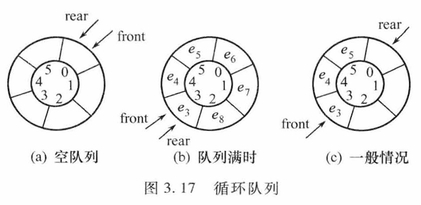

# 3.1 栈
## 3.1.1 栈的定义
### 1. 概念
- 限定性线性表：插入、删除**只能在同一端**进行。
- 允许操作的一端叫**栈顶（Top）**，另一端叫**栈底（Bottom）**。
- 无元素时为空栈。
- 修改原则：**后进先出（LIFO）**。
  
### 2. 术语
- 入栈/进栈：插入操作。
- 出栈/退栈：删除操作。

### 3. 实例
- 手枪弹夹：先压入的子弹最后打出。
- 铁路调度站：车辆先进后出。

### 4. 抽象数据类型 ADT Stack
| 操作 | 描述 |
|---|---|
| `InitStack(S)` | 初始化空栈 |
| `ClearStack(S)` | 置空栈 |
| `IsEmpty(S)` | 判空，空返回 TRUE |
| `IsFull(S)` | 判满，满返回 TRUE |
| `Push(S,x)` | 栈顶插入 x；满则失败返回 FALSE |
| `Pop(S,x)` | 弹出栈顶元素并由 x 带回；空则失败返回 FALSE |
| `GetTop(S,x)` | 读取栈顶元素到 x，**不弹出**；空则失败返回 FALSE |
## 3.1.2 栈的表示和实现
> 栈作为一种特殊的线性表，在计算机中主要有两种基本的存储结构：顺序存储结构和链式存储结构。我们简称顺序存储的栈为顺序栈，链式存储的栈为链栈。

### 1. 顺序栈
顺序栈：用顺序存储结构实现的栈，即利用一组地址连续的存储单元依次存放自栈底到栈顶的数据元素

由于栈操作的特殊性，还必须附设一个位置指针 top（栈顶指针）来动态地指示栈顶元素在顺序栈中的位置。
通常以 top=-1 表示空栈。

定义如下
```c
#define Stack_Size 50	//设栈中元素个数为 50
typedef struct{
	StackElementType elem[Stack_Size];	//用来存放栈中元素的一维数组
	int top;	//用来存放栈顶元素的下标，top 为－1 表示空栈
}SeqStack;
```

#### 1 . 初始化
   ```c
   void InitStack(SeqStack *S){
		S->top=-1;	//构建空栈S
   }
   ```
#### 2 . 进栈
```c
int Push(SeqStack *S, StackElementType x){
   if(S->top==Stack_Size-1)	//栈满
      return FALSE;
   S->elem[++(S->top)]=x;	//栈顶指针加 1 后，将元素 x 入栈
   return TRUE;
}
```
#### 3 . 出栈
```c
int Pop(SeqStack *S, StackElementType *x){
   if(S->top==-1)	//栈空
      return FALSE;
   *x=S->elem[(S->top)--];	//将栈顶元素赋值给 x 后，栈顶指针减 1
   return TRUE;
}
```
#### 4 . 读栈顶元素
```c
int GetTop(SeqStack S, StackElementType *x){
   if(S.top==-1)	//栈空
      return FALSE;
   *x=S.elem[S.top];	//将栈顶元素赋值给 x
   return TRUE;
}
```
#### 5 . 多栈共享技术
##### 双栈共享
```c
#define Stack_Size 50	//设栈中元素个数为 50
typedef struct{
   StackElementType elem[Stack_Size];	//用来存放栈中元素的一维数组
   int top1;	//用来存放栈 1 栈顶元素的下标，top1 为－1 表示栈 1 为空
   int top2;	//用来存放栈 2 栈顶元素的下标，top2 为 Stack_Size 表示栈 2 为空
}DSeqStack;
```

- 栈 1 从数组的低地址端开始向高地址端增长，栈 2 从数组的高地址端开始向低地址端增长。
- 当 top1+1 == top2 时，表示栈满。
##### 多栈共享
- 可根据需要在数组中划分多个栈空间。
### 2. 链栈
链栈：采用链表作为存储结构实现的栈

top 为栈顶指针，始终指向当前栈顶元素前面的头结点。若 top->next == NULL, 则代表栈空。
采用链栈不必预先估计栈的最大容掀，只要系统有可用空间，链栈就不会出现溢出
对于链栈，在使用完毕时，应该释放相应空间
```c
typedef struct node{
	StackElementType data;
	struct node *next;
}LinkStackNode;
typedef LinkStackNode *LinkStack;
```
#### 1. 进栈操作
```c
int Push(LinkStack	top, StackElementType x){
   //在链栈 top 中插入元素 x
	LinkStackNode *temp;
	temp = (LinkStackNode *)malloc(sizeof(LinkStackNode));
   if(temp == NULL)
      return(FALSE); //存储分配失败
   temp -> data = x;
   temp -> next = top -> next;
   top -> next = temp;//将新节点插入到栈顶
   return(TRUE);
}
```
#### 2. 出栈操作
```c
int Pop(LinkStack top, StackElementType *x){
   //删除链栈 top 的栈顶元素，并用 x 返回其值
   LinkStackNode *temp;
   if(top -> next == NULL)
      return(FALSE); //栈空
   temp = top -> next;
   *x = temp -> data;   
   top -> next = temp -> next; //将栈顶节点删除
   free(temp); //释放被删除节点的空间
   return(TRUE);
}
```
#### 3. 多栈运算
- 多个链栈可以共用一个头结点，只需为每个链栈设置一个栈顶指针即可。
```c
#define M 10 //设M个链栈共享一个头结点
typedef struct{
   StackElementType data;
   struct node *next;
}LinkStackNode;*LinkStack;
LinkStackNode top[M]; //M个链栈的头结点数组
```   
top[i] 为第 i 个链栈的头结点,分别指向M个不同的链栈。

## 3.1.3 栈的应用举例
### 括号匹配
- 问题描述：在一个表达式中，括号必须成对出现且前后对应，否则称为括号不匹配。
- 解决思路：从左到右扫描表达式，遇到左括号时将其入栈，遇到右括号时则从栈顶弹出一个左括号与之匹配，直到表达式扫描完毕。如果栈为空，则括号匹配，否则不匹配。
```c
int BracketMatch(char str[]){
   SeqStack S;
   char ch, x;
   int i=0;
   InitStack(&S);
   while((ch=str[i++])!='\0'){
      if(ch=='(' || ch=='[' || ch=='{'){
         Push(&S, ch); //左括号入栈
      }
      else if(ch==')' || ch==']' || ch=='}'){
         if(IsEmpty(S))
            return(FALSE); //栈空，括号不匹配
         Pop(&S, &x); //弹出栈顶左括号
         if((ch==')' && x!='(') || (ch==']' && x!='[') || (ch=='}' && x!='{'))
            return(FALSE); //括号不匹配
      }
   }
   if(IsEmpty(S))
      return(TRUE); //栈空，括号匹配
   else
      return(FALSE); //栈不空，括号不匹配
}
```
### 表达式求值
- 问题描述：计算一个算术表达式的值。
- 解决思路：利用两个栈分别存放操作数和运算符，根据运算符的优先级进行计算，直到表达式扫描完毕，操作数栈中剩下的即为表达式的值。
- 无括号表达式求值示例代码如下
```c
int EvaluateExpression(char expr[], int *result){
   SeqStack opndStack, optrStack;
   char ch, op;
   int i=0, opnd1, opnd2, res;
   InitStack(&opndStack);
   InitStack(&optrStack);
   Push(&optrStack, '#'); //哨兵
   while((ch=expr[i++])!='\0' || !IsEmpty(optrStack)){
      if(isdigit(ch)){
         Push(&opndStack, ch - '0'); //操作数入栈
      }
      else{
         while(Precede(GetTop(optrStack), ch)=='>'){
            Pop(&optrStack, &op); //弹出运算符
            Pop(&opndStack, &opnd2); //弹出操作数
            Pop(&opndStack, &opnd1);
            res = Operate(opnd1, op, opnd2); //计算
            Push(&opndStack, res); //结果入栈
         }
         if(ch != '\0')
            Push(&optrStack, ch); //运算符入栈
      }
   }
   Pop(&opndStack, result); //结果出栈
   return(TRUE);
}
```



## 3.1.4 栈与递归的实现
> **递归**是指在定义自身的同时又出现了对自身的引用。如果一个函数在其定义体内直接调用自己，则称为**直接递归函数**；如果一个函数经过一系列的中间调用语句，通过其他函数间接调用自己，则称为**间接递归函数**

### 1. 具有递归特性的问题
1. 递归定义的数学函数
	- 二阶斐波那契数列
	- 阿克曼函数
2. 递归数据结构的处理
	- 广义表
	- 二叉树
	- 树
3. 递归求解问题
	- 汉诺塔
		  
	- 快速排序
	- 深度优先算法
### 2. 递归过程的实现
递归进层（i->i+1 层）系统需要做三件事：
1. 保留本层参数与返回地址
2. 为被调用函数的局部变橘分配存储区，给下层参数赋值
3. 将程序转移到被调函数的入口
   
而从被调用函数返回调用函数之前，递归退层（i<-i+1 层）系统也应完成三件工作：

1. 保存被调函数的计算结果。
2. 释放被调函数的数据区，恢复上层参数
3. 依照被调函数保存的返回地址，将控制转移回调用函数
递归函数调用时，应按照“**后调用先返回**”的原则处理调用过程，因此上述函数之间的信息传递和控制转移必须通过栈来实现

#### 1. 调用规则
- **后调用先返回**：函数调用顺序由系统栈保证。
- 每调用一次函数 → 在栈顶分配新存储区；
- 每退出一次函数 → 弹出并释放其存储区。
- **当前运行函数的数据区必在栈顶**。

#### 2. 递归函数的“层次”
- 主函数：第 0 层  
- 主函数首次调用递归函数：进入第 1 层  
- 递归函数再次调用自身：进入“下一层” i+1  
- 退出第 i 层：返回“上一层” i-1  

#### 3. 递归工作栈（系统管理）
- **作用**：保存每层递归所需信息。
- **内容（一个工作记录）**：
  - 实在参数
  - 局部变量
  - 上一层的返回地址
- **操作**：
  - 进入一层：新工作记录**压栈**。
  - 退出一层：工作记录**弹栈**。
- **活动记录**：当前执行层的工作记录（位于栈顶）。
- **当前环境指针**：指向活动记录的栈顶指针。

### 3. 递归算法到非递归算法的转换
#### 转换动机
1. 时空效率：系统隐式栈开销大，递归常数高。  
2. 语言限制：如 FORTRAN 无递归机制。  
3. 过程可见性：递归中间过程对用户封闭，某些场景需暴露控制流程。

#### 两类通用方法
| 方法 | 适用场景 | 核心手段 |
|---|---|---|
| 循环替代 | 尾递归、单向递归 | 直接改写成 `for`/`while` |
| 用户栈模拟 | 复杂/树形递归 | 用自建栈保存“返回地址、参数、局部变量” |

#### 循环替代实例

##### 单向递归 —— Fibonacci
**递归版**  
```c
long Fib(int n) {
    if (n == 0 || n == 1) return n;
    return Fib(n-1) + Fib(n-2);   // 两次递归，大量重复
}
```  
时间复杂度 **O (2ⁿ)**，空间 **O (n)**（系统栈）。

**非递归版（算法 3.13）**  
```c
long Fib(int n) {
    if (n == 0 || n == 1) return n;
    long x = 0, y = 1, z;          // x=F(i-2), y=F(i-1)
    for (int i = 2; i <= n; ++i) {
        z = y;      // 暂存 F(i-1)
        y = x + y;  // F(i)
        x = z;      // 新的 F(i-1)
    }
    return y;
}
```  
时间 **O (n)**，空间 **O (1)**；无重复计算。

##### 尾递归 —— 阶乘
**递归版（算法 3.14）**  
```c
long Fact(int n) {
    if (n == 1) return 1;
    return n * Fact(n-1);   // 递归调用在末尾
}
```  
编译器可自动优化成跳转；若手工改写：

**非递归版（算法 3.15）**  
```c
long Fact(int n) {
    long fac = 1;
    for (int i = 1; i <= n; ++i)
        fac *= i;
    return fac;
}
```  
时间 **O (n)**，空间 **O (1)**。

#### 通用用户栈模拟思路（小结）
1. 定义“工作记录”结构：保存 `参数、局部变量、返回地址`。  
2. 初始化栈，将首次调用的记录压栈。  
3. 循环直到栈空：  
   a. 弹出栈顶记录 → 当前“活动记录”。  
   b. 用 `switch` / `goto` 跳转到对应“返回地址”段。  
   c. 根据算法逻辑，把新的调用记录压栈（模拟递归入口）。  
4. 释放已弹出的记录，继续循环。  

结果：把系统隐式栈变为显式用户栈，彻底消除递归，保持原算法流程。
# 3.2 队列
## 3.2.1 队列的定义
**队列(Queue)** 是另一种限定性的线性表，它只允许在表的一端插入元素，而在另一端删除元素，所以队列具有**先进先出 (First In First Out, FIFO)** 的特性
在队列中，允许插入的一端称为**队尾 (Rear)** ，允许删除的一端则称为**队头(Front)**
**ADT Queue** {
	**数据元素**：可以是任意类型的数据，但必须属于同一个数据对象。
	**结构关系**：队列中数据元素之间是线性关系。
		**基本操作**：
	1. InitQueue (Q)
		操作前提：Q 为未初始化的队列。
		操作结果：将 Q 初始化为一个空队列。
	2. IsEmpty (Q)
		操作前提：队列 Q 已经存在
		操作结果：若队列为空，则返回 TRUE，否则返回 FALSE。
	3. IsFull (Q)
		操作前提：队列 Q 已经存在
		操作结果：若队列为满，则返回 TRUE，否则返回 FALSE。
	4. EnterQueue (Q, x)
		操作前提：队列 Q 已经存在
		操作结果：在队列 Q 的队尾插入 X。操作成功，返回值为 TRUE，否则返回值为FALSE。
	5. DeleteQueue (Q, x)
		操作前提：队列 Q 已经存在
		操作结果：将队列 Q 的队头元素出队，并用 x 带回其值。操作成功，返回值为TRUE，否则返回值为 FALSE。
	6. DeleteQueue (Q, x)
		操作前提：队列 Q 已经存在
		操作结果：将队列 Q 的队头元素出队，并用 x 带回其值。操作成功，返回值为TRUE，否则返回值为 FALSE。
	7. GetHead (Q, x)
		操作前提：队列 Q 已经存在
		操作结果：取队列 Q 的队头元素（该元素不出队），并用 x 带回其值。操作成功，返回 TRUE，否则返回值为 FALSE。
	8. ClearQueue (Q)
		操作前提：队列 Q 已经存在。
		操作结果：将队列 Q 置为空队列。
		
}**ADT Queue**;
## 3.2.2 队列的表示和实现
> 与线性表类似，队列也可以有两种存储表示，即顺序表示和链式表示

### 1 . 链队列
用链表表示的队列简称为**链队列**

通常将队头指针和队尾指针封装在一个结构体中，并将该结构体类型重新命名为链队列类型。链队列定义如下：
```c
typedef struct Node{
	QueueElementType data;
	struct Node *Next;
}LinkQueueNode;
typedef struct{
	LinkQueueNode *front;
	LinkQueueNode *rear;
}LinkQueue;
```
链队列的基本操作包括初始化、入队、出队等操作
```c
//链队列的初始化
int InitQueue(LinkQueue *Q){
   Q -> front = Q -> rear = (LinkQueueNode *)malloc(sizeof(LinkQueueNode));
   if(Q -> front == NULL)
      return(FALSE); //存储分配失败
   Q -> front -> Next = NULL; //空队列
   return(TRUE);
}
//链队列的入队操作
int EnterQueue(LinkQueue *Q, QueueElementType x){
   LinkQueueNode *temp;
   temp = (LinkQueueNode *)malloc(sizeof(LinkQueueNode));
   if(temp == NULL)
      return(FALSE); //存储分配失败
   temp -> data = x;
   temp -> Next = NULL;
   Q -> rear -> Next = temp; //将新节点插入到队尾
   Q -> rear = temp; //修改队尾指针
   return(TRUE);
}
//链队列的出队操作
int DeleteQueue(LinkQueue *Q, QueueElementType *x){
   LinkQueueNode *temp;
   if(Q -> front == Q -> rear)
      return(FALSE); //队列空
   temp = Q -> front -> Next;
   *x = temp -> data; //将队头元素赋值给 x
   Q -> front -> Next = temp -> Next; //将队头节点删除
   if(Q -> rear == temp) //若队头就是队尾
      Q -> rear = Q -> front; //修改队尾指针
   free(temp); //释放被删除节点的空间
   return(TRUE);
}
```
### 2 . 循环队列
与顺序栈类似，在队列
的顺序存储结构中，用一组地址连续的存储单元依次存放从队头到队尾的
元素，如一维数组 Queue[MAXSIZE] 表示一个顺序队列

为了区别队空和队满状态，通常约定队列中**最多只能存放 MAXSIZE-1 个元素**
 
顺序队列定义如下：
```c  
#define MAXSIZE 50 //设队列中元素个数为 50
typedef struct{
   QueueElementType elem[MAXSIZE]; //用来存放队列中元素的一维数组
   int front; //队头指针
   int rear; //队尾指针
}SqQueue;
```
顺序队列的基本操作包括初始化、入队、出队等操作  
```c
//顺序队列的初始化
int InitQueue(SqQueue *Q){
   Q -> front = Q -> rear = 0; //空队列
   return(TRUE);
}
//顺序队列的入队操作
int EnterQueue(SqQueue *Q, QueueElementType x){
   if((Q -> rear + 1) % MAXSIZE == Q -> front)
      return(FALSE); //队列满
   Q -> elem[Q -> rear] = x; //将元素 x 插入到队尾
   Q -> rear = (Q -> rear + 1) % MAXSIZE; //修改队尾指针
   return(TRUE);
}
//顺序队列的出队操作
int DeleteQueue(SqQueue *Q, QueueElementType *x){
   if(Q -> front == Q -> rear)
      return(FALSE); //队列空
   *x = Q -> elem[Q -> front]; //将队头元素赋值给 x
   Q -> front = (Q -> front + 1) % MAXSIZE; //修改队头指针
   return(TRUE);
}
```
## 3.2.3 队列的应用举例
### 打印杨辉三角
```c
void PrintYangHuiTriangle(int n){
   SqQueue Q;
   int i, j, count, value, preValue, curValue;
   InitQueue(&Q);
   EnterQueue(&Q, 1); //第一行入队
   for(i = 1; i <= n; i++){
      count = i; //每行元素个数
      preValue = 0; //前一个元素值
      for(j = 1; j <= count; j++){
         DeleteQueue(&Q, &curValue); //出队
         printf("%d ", curValue); //打印当前元素
         value = preValue + curValue; //计算下一个元素值
         EnterQueue(&Q, value); //下一个元素入队
         preValue = curValue; //更新前一个元素值
      }
      printf("\n"); //换行
   }
}
```
### 键盘输入循环缓冲区
```c
#define BUFFER_SIZE 1024
typedef struct{
   char buffer[BUFFER_SIZE];
   int front; //队头指针
   int rear; //队尾指针
}CircularBuffer;
//初始化循环缓冲区
void InitBuffer(CircularBuffer *cb){
   cb -> front = cb -> rear = 0;
}
//向循环缓冲区写入数据
int WriteBuffer(CircularBuffer *cb, char ch){
   if((cb -> rear + 1) % BUFFER_SIZE == cb -> front)
      return(FALSE); //缓冲区满
   cb -> buffer[cb -> rear] = ch; //写入数据
   cb -> rear = (cb -> rear + 1) % BUFFER_SIZE; //修改队尾指针
   return(TRUE);
}
//从循环缓冲区读取数据
int ReadBuffer(CircularBuffer *cb, char *ch){
   if(cb -> front == cb -> rear)
      return(FALSE); //缓冲区空
   *ch = cb -> buffer[cb -> front]; //读取数据  
   cb -> front = (cb -> front + 1) % BUFFER_SIZE; //修改队头指针
   return(TRUE);
}
```