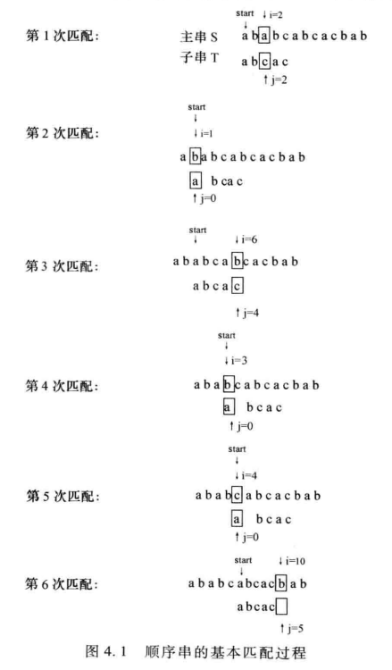

# 4.1 串的基本概念
## 一、串的基本概念

- **定义**：  
  串（String）是由零个或多个字符组成的有限序列，记作：  
  `S = "a₁a₂...aₙ"`（n ≥ 0）

- **字符集**：  
  每个字符 `aᵢ` 可以是字母、数字或其他符号。

- **串的长度**：  
  字符个数 `n`，当 `n = 0` 时称为 **空串（Null String）**。

- **引号作用**：  
  串值用单引号（或双引号）括起，引号本身不属于串内容，仅作界限符。
## 二、子串与主串

- **子串**：串中任意连续的字符组成的子序列。  
- **主串**：包含子串的串。  
- **位置表示**：子串在主串中的位置由其第一个字符在主串中的位置表示。

✅ **例子**：  
设 `A = 'ChinaBeijing'`，`B = 'Beijing'`，`C = 'China'`  
- B 是 A 的子串，位置为 7  
- C 是 A 的子串，位置为 1

## 三、串的比较与相等

- **串相等**：  
  两个串长度相等，且对应位置字符完全相同。

- **空串 vs 空格串**：
  - 空串：不含任何字符，长度为 0  
  - 空格串：由一个或多个空格组成，长度为空格个数


## 四、串的逻辑结构

- 串是**线性结构**的一种特例，逻辑结构与线性表相似，区别在于：
  - 数据元素限定为**字符**
  - 操作以**子串**为单位

## 五、串的抽象数据类型（ADT String）

**数据对象**：  
`D = {aᵢ | aᵢ ∈ CharacterSet, i = 1,2,...,n, n ≥ 0}`

**结构关系**：  
`R = {<aᵢ, aᵢ₊₁> | aᵢ, aᵢ₊₁ ∈ D, i = 1,...,n-1}`

## 六、基本操作（按功能分类）

| 操作类别 | 操作名 | 功能说明 |
|----------|--------|----------|
| **赋值** | `StrAssign(S, chars)` | 生成一个值等于 `chars` 的串 S |
| **插入** | `StrInsert(S, pos, T)` | 在 S 的第 `pos` 个字符前插入串 T |
| **删除** | `StrDelete(S, pos, len)` | 删除 S 中从第 `pos` 个字符起长度为 `len` 的子串 |
| **复制** | `StrCopy(S, T)` | 用串 T 的值复制生成串 S |
| **判空** | `StrEmpty(S)` | 若 S 为空串，返回 TRUE，否则 FALSE |
| **比较** | `StrCompare(S, T)` | 比较 S 与 T，返回 >0、=0、<0 |
| **长度** | `StrLength(S)` | 返回串 S 的长度 |
| **清空** | `StrClear(S)` | 将 S 置为空串 |
| **连接** | `StrCat(S, T)` | 将串 T 连接在串 S 的末尾 |
| **取子串** | `SubString(Sub, S, pos, len)` | 从 S 的第 `pos` 个字符起取长度为 `len` 的子串，存入 Sub |
| **查找** | `StrIndex(S, pos, T)` | 从 S 的第 `pos` 个字符后查找子串 T，返回首次出现位置，若无则返回 0 |
| **替换** | `StrReplace(S, T, V)` | 用 V 替换 S 中所有与 T 相等的非重叠子串 |
| **销毁** | `StrDestroy(S)` | 销毁串 S，释放资源 |

# 4.2 串的存储实现
>  常用的实现方法有定长顺序串、堆串和块链串
## 4.2.1 定长顺序串
### 1. 定长顺序串存储结构
```c
#define MAXLEN 40
typedef struct{
  char ch[MAXLEN];  //串结构定义
  int len;
}SString;
```
### 2. 定长顺序串基本操作的实现
串的基本运算除了与线性表类似的插入、删除、修改运算外，还有在字
符串中求子串、求子串在主串中的位置等运算
#### 1. 串插入函数
```c
Status StrInsert(SString *S, int pos, SString T){
  int i;
  if(S->len + T.len > MAXLEN) //长度溢出
    return ERROR;
  if(pos < 1 || pos > S->len + 1) //插入位置不合法
    return ERROR;
  for(i = S->len - 1; i >= pos - 1; i--) //后移
    S->ch[i + T.len] = S->ch[i];
  for(i = 0; i < T.len; i++) //插入T
    S->ch[pos - 1 + i] = T.ch[i];
  S->len += T.len; //更新长度
  return OK;
}
```
#### 2. 串删除函数
```c
Status StrDelete(SString *S, int pos, int len){
  int i;
  if(pos < 1 || pos > S->len || len < 0 || pos + len - 1 > S->len)
    return ERROR; //删除位置不合法
  for(i = pos - 1; i <= S->len - len - 1; i++) //前移
    S->ch[i] = S->ch[i + len];
  S->len -= len; //更新长度
  return OK;
}
```
#### 3. 串比较函数
```c
int StrCompare(SString S, SString T){
  int i;
  for(i = 0; i < S.len && i < T.len; i++){
    if(S.ch[i] != T.ch[i])
      return S.ch[i] - T.ch[i]; //返回ASCII差值
  }
  return S.len - T.len; //长度不同则返回长度差值
}
```
#### 4. 定位函数
```c
int StrIndex(SString S, int pos, SString T){
  int i, j;
  if(pos < 1 || pos > S.len - T.len + 1)
    return 0; //起始位置不合法
  for(i = pos - 1; i <= S.len - T.len; i++){
    j = 0;
    while(j < T.len && S.ch[i + j] == T.ch[j])
      j++;
    if(j == T.len)
      return i + 1; //返回位置
  }
  return 0; //未找到
}
```
### 3. 串的简单模式匹配 Bruce-Force算法
算法思想：简单的模式匹配算法是一种带回溯的匹配算法，算法的基本思想是：从主串 S 的第 pos 个字符开始，和模式串 T 的第一个字符开始比较，如果相等，就继续比较后续字符，如果不等，则从（回溯到）主串 S 的第 pos+1 个字符开始重新和模式串 T 比较，直到模式串 T 中的每一个字符和主串 S 中的一个连续字符子序列全部相等，则称匹配成功，返回和 T 中第一个字符相等的字符在主串 S 中的位置；或者主串中没有和模式串相等的字符序列，则称匹配不成功。

实现时设 i、j、start 三个指示器：
- i 指向主串 S 中当前比较的字符，起始指向 S 的首字符，此后，每比较一步，后移一个位置，一趟匹配失败时，回溯到该趟比较起点的下一位置
- j 指向子串 T 中当前比较的字符，起始指向 T 的首字符，此后，每比较一步，后移一个位置，一趟匹配失败时，回溯到 T 的首字符处
- Start 记录每趟比较时在主串 S 中的起点，每趟比较后，后移一个位置，以便确定下一趟的起始位置
  
顺序串的简单模式匹配算法实现如下：
```c
int BF(SString S, int pos, SString T){
  int i = pos - 1; //主串指针
  int j = 0;       //子串指针
  while(i < S.len && j < T.len){
    if(S.ch[i] == T.ch[j]){ //字符匹配
      i++;
      j++;
    } else {                //字符不匹配
      i = i - j + 1;        //主串指针回溯
      j = 0;                //子串指针回溯
    }
  }
  if(j >= T.len)
    return i - T.len + 1; //返回位置
  else
    return 0;             //未找到
}
```
## 4.2.2 堆串

### 1. 串的组成
- **串名**：由符号表存储
- **串值**：采用堆串存储方法存储

### 2. 堆串存储方法
- **定义**：以一组地址连续的存储单元顺序存放串中的字符，存储空间在程序执行过程中**动态分配**
- **可用空间**：系统将一个地址连续、容量很大的存储空间作为字符串的可用空间
- **分配方式**：每当建立一个新串时，系统从可用空间中分配一个大小与字符串长度相同的空间，用于存储新串的串值

### 3. 串名符号表
- **定义**：所有串名的存储映像构成一个符号表
- **作用**：在串名和串值之间建立对应关系，称为串名的存储映像

### 4. 示例
- 图4.2展示堆串存储及符号表
  - a = "aprogram"
  - b = "string"
  - c = "process"
  - free = 23

### 5. C语言实现
- C语言提供“堆”作为自由存储空间
- 使用`malloc()`和`free()`进行动态存储管理
- 堆串定义：
  ```c
  typedef struct {
      char *ch; // 指向动态分配的存储空间
      int len;  // 串长度
  } HString;
  ```
## 4.2.3 块链串
块链串是一种将串的存储空间划分为若干块，并用链表连接这些块的存储结构。每块包含一部分字符和指向下一块的指针。
### 块链串存储结构
```c
#define BLOCK_SIZE 4 // 每块存储的最大字符数
typedef struct Block {
    char ch[BLOCK_SIZE]; // 存储字符
    struct Block *next;  // 指向下一块的指针
} Block;
typedef struct {
    Block *head; // 指向块链串的头块
    int len;     // 串长度
} BString;
```
# 4.3 串的应用举例：简单的行编辑器
## 4.3.1 行编辑器的基本功能
- 插入文本
- 删除文本
- 查找子串
- 替换子串
- 显示当前文本
## 4.3.2 行编辑器的实现思路
- 使用堆串或块链串存储文本内容
- 提供用户交互界面，接受命令并执行相应操作
## 4.3.3 示例代码片段
```c
void InsertText(BString *text, int pos, BString insertStr) {
    // 实现插入文本的逻辑
}
void DeleteText(BString *text, int pos, int len) {
    // 实现删除文本的逻辑
}
int FindSubstring(BString text, BString subStr, int pos) {
    // 实现查找子串的逻辑
}
void ReplaceSubstring(BString *text, BString oldStr, BString newStr) {
    // 实现替换子串的逻辑
}
void DisplayText(BString text) {
    // 实现显示当前文本的逻辑
}
``` 