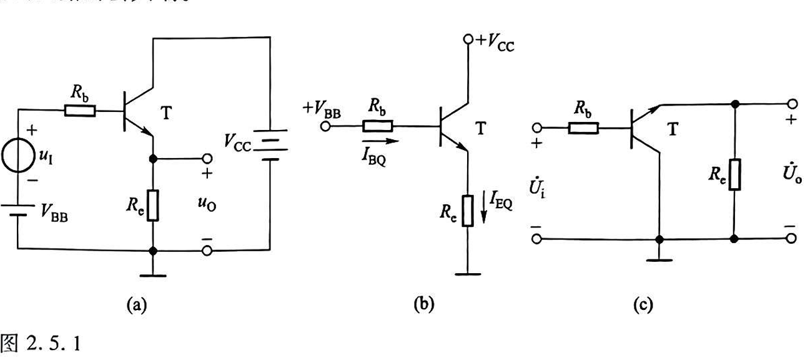

# 2.1 放大的概念和放大电路的主要性能指标
## 2.1.1 放大的概念
放大电路放大的本质是**能量的控制和转换**
电子电路放大的基本特征是**功率放大**
能够控制能量的元件称为**有源器件**
放大的前提是不失真，即只有在不失真的情况下放大才有意义
## 2.1.2 放大电路的性能指标

### 一、放大倍数
放大倍数是直接衡量放大电路放大能力的重要指标，其值为输出量$\dot{X_{o}}(\dot{u_{o}}或\dot{I_{o}})$与输入量$\dot{X_{i}}(\dot{u_{i}}或\dot{I_{i}})$之比。
电压放大倍数是输出电压 $\dot{U_{o}}$。与输入电压$\dot{U_{i}}$之比，记作$\dot{A}_{uu}$
$$\dot{A}_{uu}=\dot{A}_{u}=\frac{\dot{U_{o}}}{\dot{U_{i}}}$$
电流放大倍数是输出电流 $\dot{I}_{o}$与输入电流$\dot{I}_{\mathrm{i}}$之比，记作 
$$
\dot{A}_{\mathrm{ii}}=\dot{A}_{\mathrm{i}}=\frac{\dot{I}_{\mathrm{o}}}{\dot{I}_{\mathrm{i}}}
$$
电压对电流的放大倍数是输出电压 $\dot{U}_{\mathrm{o}}$ 与输入电流 $\dot{I}_{\mathrm{i}}$ 之比，记作 
$$
\dot{A}_{\mathrm{ui}}=\frac{\dot{U}_{\mathrm{o}}}{\dot{I}_{\mathrm{i}}}（Ω）
$$
电流对电压的放大倍数是输出电流 $\dot{I}_{\mathrm{o}}$ 与输入电压 $\dot{U}_{\mathrm{i}}$之比，记作 
$$
\dot{A}_{\mathrm{iu}}=\frac{\dot{I}_{\mathrm{o}}}{\dot{U}_{\mathrm{i}}}（S）
$$
### 二、输入电阻
放大电路与信号源相连接就成为信号源的负载，必然从信号源索取电流，电流的大小表明放大电路对信号源的影响程度
输入电阻$R_{i}$是从放大电路输入端看进去的等效电阻，定义为输入 电压有效值$U_{i}$和输入电流有效值$I_{i}$之比，即
$$
R_{i}=\frac{U_{i}}{I_{i}}
$$
### 三、输出电阻
任何放大电路的输出都可以等效成一个有内阻的电压源，从放大电路输出端看进去的等效内阻称为输出电阻$R_{o}$。$U_{o}'$为空载时输出电压的有效值，$U_{o}$为带负载后输出 电压的有效值，因此
$$
U_{o}=\frac{R_{L}}{R_{o}+R_{L}}·U_{o}'
$$
输出电阻
$$
R_{o}=\left( \frac{U_{o}'}{U_{o}}-1 \right)R_{L}
$$
测量时令 U_s=0（信号源短路）、R_L→∞

### 四、通频带
BW = f_H − f_L，其中

### 五、非线性失真系数
### 六、最大不失真输出电压
# 2.2 基本共射放大电路的工作原理
## 2.2.1 基本共射放大电路的组成及各元件的作用

## 2.2.2 设置静态工作点的必要性
### 一、静态工作点
Q 点：$(I_BQ, I_CQ, U_CEQ)$,
### 二、为什么要设置静态工作点
对于放大电路的最基本要求，一是不失真，二是能够放大
## 2.2.3 基本共射放大电路的工作原理及波形分析

## 2.2.4 放大电路的组成原则
### 一、组成原则
1. 必须根据所用放大管的类型提供直流电源，以便设置合适的静态工作点，并作为输出的能源
2. 电阻取值得当，与电源配合，使放大管有合适的静态工作点
3. 输入信号必须能够作用于放大管的输入回路
4. 当负载接入时，必须保证放大管输出回路的动态电流(晶体管的$\Delta i_{C}、\Delta i_{E}$或场效应管的$\Delta i_{D}、\Delta i_{S}$)能够作用于负载，从而使负载获得比输入信号大得多的信号电流或信号电压。
### 二、两种实用的共射放大电路

# 2.3 放大电路的分析方法
> 分析放大电路就是在理解放大电路工作原理的基础上求解静态工作点和各项动态参数
## 2.3.1 直流通路与交流通路
**直流通路**是在**直流电源**作用下**直流电流**流经的**通路**，也就是静态电流流经的通路，用于研究静态工作点
**交流通路**是**输入信号**作用下**交流信号**流经的**通路**，用于研究动态参数
1. 直流通路：
	1. $u_{S}$=0，保留$R_s$;
	2. 电容开路
	3. 电感相当于短路（线圈电阻近似为0）
2. 交流通路
	1. 大容量电容相当于短路
	2. 直流电源相当于短路（内阻为0）
## 2.3.2 图解法
### 一、静态工作点的分析
> 图解二元方程

$$
u_{BE}=V_{BB}-i_{B}R_{b}
$$
$$
u_{CE}=V_{CC}-i_{C}R_{c}
$$
### 二、电压放大倍数的分析

$$
u_{BE}=V_{BB}+\Delta u_{1}-i_{B}R_{b}
$$
### 三、波形非线性失真的分析
#### 截止失真

#### 饱和失真

## 2.3.3 等效电路法
### 一、晶体管的直流模型及静态工作点的估算法

### 二、晶体管共射h参数等效模型

利用PN结的电流方程可求得
$$
r_{be}=\frac{U_{be}}{I_{b}}=r_{bb'}+r_{b'e}\approx r_{bb'}+(1+\beta)\frac{U_{T}}{I_{EQ}}
$$
#### 简化的h参数等效模型

$$
\dot{I_{c}}=\beta \dot{I_{b}}
$$
# 2.4 放大电路静态工作点的稳定
## 一、温度对静态工作点的影响
在引起 Q 点不稳定的诸多因素中，温度对晶体管参数的影响是人为难以解决的。  
当环境温度升高时：  
1. 电流放大系数$β$增大；  
2. 穿透电流 $I_{CEO}$ 增大；  
3. 集中表现为集电极电流 $I_{CQ}$ 明显增大；  
4. 共射电路中晶体管的管压降 $U_{CEQ}$ 将减小；  
5. Q 点沿直流负载线上移到 Q′，向饱和区变化；  
6. 欲使之回到原来位置，必须减小基极电流 $I_{BQ}$。  
当温度降低时，Q 点将沿直流负载线下移，向截止区变化，必须增大 $I_{BQ}$ 才能维持 Q 点基本不变。  
结论：稳定 Q 点，通常是指在环境温度变化时静态集电极电流 $I_{CQ}$ 和管压降 $U_{CEQ}$ 基本不变，即 Q 点在晶体管输出特性坐标平面中的位置基本不变；必须依靠 $I_{BQ}$ 的变化来抵消 $I_{CQ}$ 和 $U_{CEQ}$ 的变化。
## 二、稳定原理
1. 电路组成与 Q 点稳定原理  
	1. 电路形式  
		图 2.4.2 (a) 直接耦合方式；  
		图 2.4.2 (b) 阻容耦合方式；  
		二者具有相同的直流通路，如图 2.4.2 (c) 所示。 
		
	2. 参数选取条件  
		   为稳定 Q 点，通常使  I_1 ≫ I_BQ  (2.4.1)  于是 I_2≈I_1，基极电位  U_BQ ≈ (R_b 2)/(R_b 1+R_b 2)·V_CC  (2.4.2)  式 (2.4.2) 表明 U_BQ 几乎仅由 R_b 1、R_b 2 对 V_CC 分压决定，与温度无关。
	3. 温度稳定性自动调节过程  
		   $T (℃)↑ → I_C↑ → I_E↑ → U_E↑ (因 U_BQ 基本不变) → U_BE↓ → I_B↓ → I_C↓$
		   结果：I_C 随温度升高而增大的部分几乎被因 I_B 减小而减小的部分抵消，I_C、U_CE 基本不变，Q 点位置基本不变。  
	4. 反馈性质  
		   R_e 将输出量 (I_C) 的变化转化为电压变化引回输入回路影响输入量 (U_BE)，使输出量变化减小——直流负反馈；R_e 为直流负反馈电阻。  

3. 静态工作点的估算  
	已知条件：I_1≫I_BQ  
	1. 基极电位  
		U_BQ = (R_b 2)/(R_b 1+R_b 2)·V_CC  
	2. 发射极电流  
		I_EQ = (U_BQ - U_BEQ)/R_e  (2.4.3)  
	3. 管压降  
		U_CEQ ≈ V_CC - I_CQ (R_c + R_e)  (2.4.4)  
	4. 基极电流  
		I_BQ = I_CQ/(1+β)  (2.4.5)  

5. 动态参数的估算  
	1. 有旁路电容 C_e（图 2.4.4 a）  
		电压放大倍数  
		A_u = -β(R_c // R_L)/r_be  (2.4.6 a)  
		输入电阻  
		R_i = R_b 1 // R_b 2 // r_be  (2.4.6 b)  
		输出电阻  
		R_o = R_c  (2.4.6 c)  
	2. 无旁路电容 C_e（图 2.4.4 b）  
		电压放大倍数  
		A_u = -β(R_c // R_L)/[r_be + (1+β) R_e]  (2.4.7 a)  
		输入电阻  
		R_i = R_b 1 // R_b 2 // [r_be + (1+β) R_e]  (2.4.7 b)  
		输出电阻  
		R_o = R_c  (2.4.7 c)  
	3. 近似条件  
		若 (1+β) R_e≫r_be 且β≫1，则  
		|A_u| ≈ (R_c // R_L)/R_e  (2.4.8)  
		此时电压放大倍数几乎仅取决于电阻取值，受温度影响很小，温度稳定性好。  
## 三、Q 点分析

1. 直流负反馈——典型电路已述。  
2. 温度补偿  
（1）利用二极管反向特性（图 2.4.6 a）  
温度↑ → I_R↑ → I_D↑ → I_B↓ → I_C↓，抵消 I_C 的增大。 
（2）利用二极管正向压降（图 2.4.6 b）  
温度↑ → U_D↓ → U_B↓ → U_BE↓ → I_B↓ → I_C↓，同时具有直流负反馈作用。
# 2.5 晶体管单管放大电路的三种基本接法
## 一、基本共集放大电路

1. 静态分析
2. 动态分析
   - 输入电阻的分析
   - 输出电阻的分析
# 2.6 场效应管
## 一、场效应管（以N沟道为例）
单极型管：噪声小，抗辐射能力强，低电压工作
1. 结型场效应管